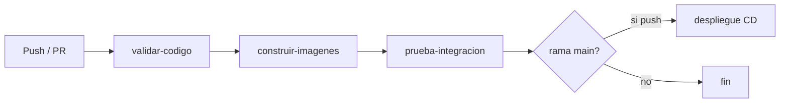

# Entrega: CI/CD con GitHub Actions (GNUCannabis)

Documento de apoyo para la ultima entrega. Resume el archivo YAML, el disparador y que capturas incluir en el informe o video.

## 1. Archivo YAML (punto 2 de la guia)

**Ubicacion:** `.github/workflows/ci-cd.yml`

**Que hace el pipeline:**

| Job | Etapa | Descripcion |
|-----|--------|-------------|
| `validar-codigo` | CI | Instala dependencias Python, compila `src/` y ejecuta `pip check`. |
| `construir-imagenes` | CI | Construye las imagenes Docker del API Flask y del frontend Nginx. |
| `prueba-integracion` | CI | Levanta MySQL + API + frontend con `docker-compose.ci.yml` y llama a `/api/health` y al puerto 3000. |
| `despliegue` | CD | Solo en push a `main` o `master`. Simula despliegue y guarda un artefacto `release-tag`. |

**Flujo visual:**



**Capturas sugeridas para el profesor:**

1. Contenido del archivo `.github/workflows/ci-cd.yml` en el editor o en GitHub.
2. Pestaña **Actions** con el workflow **CI/CD GNUCannabis** en verde.
3. Detalle de una ejecucion mostrando los 4 jobs (o 3 si la rama no es `main`).

## 2. Disparador (punto 3 de la guia)

El workflow se ejecuta automaticamente en estos eventos:

```yaml
on:
  push:
    branches: [main, master, dev, integration]
  pull_request:
    branches: [main, master, dev, integration]
```

Cada **commit** que subas a GitHub en esas ramas dispara el pipeline sin intervencion manual.

### Como demostrar al menos 2 commits

1. Crea el repositorio en GitHub (si aun no existe) y agrega el remoto:

```bash
git remote add github https://github.com/TU_USUARIO/gnucannabis.git
# o por SSH: git@github.com:TU_USUARIO/gnucannabis.git
```

2. **Primer commit** — agrega el workflow:

```bash
git add .github/workflows/ci-cd.yml docker-compose.ci.yml docs/ENTREGA_CI_CD_GITHUB_ACTIONS.md
git commit -m "feat: agregar pipeline CI/CD con GitHub Actions"
git push github main
```

3. Espera a que termine la primera ejecucion en **Actions**.

4. **Segundo commit** — cambio minimo para volver a disparar CI:

```bash
# ejemplo: una linea en README
git add README.md
git commit -m "docs: documentar pipeline CI/CD en README"
git push github main
```

5. Captura la lista de **dos ejecuciones** del workflow (una por commit).

## 3. Diferencia con Azure DevOps (entrega anterior)

| Aspecto | Azure DevOps | GitHub Actions (esta entrega) |
|---------|----------------|-------------------------------|
| Archivo | `azure-pipelines.yml` | `.github/workflows/ci-cd.yml` |
| Disparador | push al repo Azure | `on: push` en GitHub |
| UI | Pipelines en Azure | pestana **Actions** en GitHub |
| Agentes | Microsoft-hosted / self-hosted | `runs-on: ubuntu-latest` |

El flujo conceptual es el mismo: **integracion continua** (build + pruebas) y **entrega continua** (job de despliegue tras pasar CI).

## 4. Texto corto para el informe (copiar/adaptar)

> Se implemento CI/CD con GitHub Actions en el repositorio GNUCannabis. El archivo `.github/workflows/ci-cd.yml` define cuatro etapas: validacion del codigo Python, construccion de imagenes Docker, prueba de integracion con MySQL y API, y una etapa CD simulada en la rama principal. El disparador `on: push` garantiza que cada commit ejecute el pipeline automaticamente; se verifico con al menos dos commits consecutivos observando dos ejecuciones exitosas en la pestana Actions de GitHub.

## 5. Solucion de problemas

- **El job de integracion falla:** revisa los logs de `auth-users-api` en la ejecucion; suele ser timeout de MySQL (el workflow reintenta el health hasta 60 s).
- **No aparece Actions:** confirma que el YAML esta en la rama por defecto del repo y que GitHub Actions esta habilitado en **Settings → Actions**.
- **El job `despliegue` no corre:** solo se ejecuta en `push` a `main` o `master`, no en PR ni en otras ramas.
- **Prueba local del compose CI:** usa `docker compose -f docker-compose.ci.yml ...` (proyecto `gnucannabis-ci`) para no detener tu stack de desarrollo.
