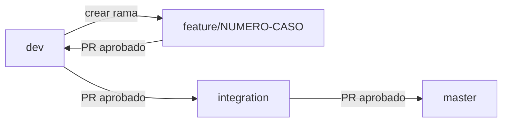

# Entrega: CI/CD con GitHub Actions (GNUCannabis)

Documento de apoyo para la ultima entrega. Alineado al flujo Git de la materia.

## Flujo Git de la materia



| Rama | Rol | Pipeline |
|------|-----|----------|
| `feature/<caso>` | Desarrollo del caso (ej. `feature/12`) | Solo **CI** (validar, build, pruebas) |
| `dev` | Integracion de casos aprobados | **CI + CD** entorno `development` |
| `integration` | Pre-produccion (dev aprobado) | **CI + CD** entorno `integration` |
| `master` | Produccion (integration aprobado) | **CI + CD** entorno `production` + artefacto |

Comandos habituales:

```bash
git checkout dev
git pull origin dev
git checkout -b feature/12
# ... commits del caso ...
git push -u origin feature/12
# Abrir PR: feature/12 -> dev

# Tras aprobar en dev:
# PR: dev -> integration

# Tras aprobar en integration:
# PR: integration -> master
```

## 1. Archivo YAML (punto 2 de la guia)

**Ubicacion:** `.github/workflows/ci-cd.yml`

**Jobs CI (todas las ramas del flujo):**

| Job | Descripcion |
|-----|-------------|
| `validar-codigo` | Python 3.12, `compileall`, `pip check` |
| `construir-imagenes` | Build Docker API + frontend |
| `prueba-integracion` | `docker-compose.ci.yml` + health check |

**Jobs CD (solo `push`, no en PR ni en `feature/*`):**

| Job | Rama | Environment |
|-----|------|-------------|
| `despliegue-dev` | `dev` | `development` |
| `despliegue-integration` | `integration` | `integration` |
| `despliegue-master` | `master` | `production` |

**Capturas sugeridas:**

1. YAML con comentarios del flujo al inicio del archivo.
2. Ejecucion en rama `feature/XX`: solo 3 jobs CI (sin CD).
3. Ejecucion en `dev`, `integration` o `master`: CI + job CD correspondiente.

## 2. Disparador (punto 3 de la guia)

```yaml
on:
  push:
    branches: [dev, integration, master, main, "feature/**"]
  pull_request:
    branches: [dev, integration, master]
```

- **Push** en `feature/*`, `dev`, `integration`, `master` dispara CI (y CD si aplica).
- **Pull request** hacia `dev`, `integration` o `master` dispara CI para validar antes de merge.

### Demostrar al menos 2 commits

Ejemplo en un caso:

```bash
git checkout dev
git checkout -b feature/99
git commit --allow-empty -m "feat(caso-99): primer commit del caso"
git push -u origin feature/99

git commit --allow-empty -m "feat(caso-99): segundo commit del caso"
git push origin feature/99
```

Captura **dos ejecuciones** del workflow en Actions para esa rama feature.

## 3. Texto para el informe

> Se configuro GitHub Actions segun el flujo de la materia: las ramas `feature/<numero-caso>` nacen de `dev` y solo ejecutan integracion continua; al integrarse en `dev` se habilita despliegue al entorno de desarrollo; tras aprobacion, la promocion a `integration` ejecuta CD de pre-produccion; y la promocion final a `master` ejecuta CD de produccion con artefacto de release. Los disparadores `on: push` y `pull_request` garantizan validacion automatica en cada commit y en cada solicitud de integracion entre ramas.

## 4. Solucion de problemas

- **No corre CD en feature:** es intencional; CD solo corre al hacer push directo a `dev`, `integration` o `master` (tras merge).
- **Environments en GitHub:** si pide aprobacion manual, configura en **Settings → Environments** (`development`, `integration`, `production`) o deja sin proteccion para la demo.
- **Compose CI local:** `docker compose -f docker-compose.ci.yml` (proyecto `gnucannabis-ci`).
